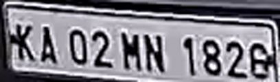

# Vibe Coding Vehicle Number Plate Detection

This project is developed by **Vibe Coding** using **VS Code GitHub Copilot**.

It detects and recognizes vehicle number plates (currently for trucks only) in video files using YOLOv8 and Tesseract OCR. The code is designed for use in a Windows environment and leverages OpenCV for image processing and display.

---

## Example Detected Plates

Below are example outputs of detected and recognized number plates:

| Example 1 | Example 2 |
|-----------|-----------|
|  |  |

---

## How to Use

### 1. Prerequisites
- Python 3.8 or newer
- Install dependencies:
  ```sh
  pip install -r requirements.txt
  ```
- Download and install [Tesseract OCR](https://github.com/tesseract-ocr/tesseract) and update the path in `main.py` if needed:
  ```python
  pytesseract.pytesseract.tesseract_cmd = r'C:\Users\YOUR_USERNAME\AppData\Local\Programs\Tesseract-OCR\tesseract.exe'
  ```
- Place your YOLOv8 model file (e.g., `yolov8n.pt`) in the project directory.
- Place your video file (e.g., `28293-369325244_small.mp4`) in the project directory.

### 2. Running the Code
- Open a terminal in the project directory.
- Run the script:
  ```sh
  python main.py
  ```
- By default, the script processes the video file specified at the bottom of `main.py`:
  ```python
  if __name__ == "__main__":
      main("28293-369325244_small.mp4", "output.xlsx")
  ```
  You can change the video filename and output Excel filename as needed.

### 3. Output
- The script will display a window showing the detection results frame by frame.
- When a truck is detected, the detected number plate region will be shown both as a pop-up and as a preview in the main display.
- The recognized number plate, vehicle type, and color for each frame are saved to `output.xlsx`.
- Detected plate images with alphanumeric OCR results are saved as PNG files in the project directory.

---

- Developed with ❤️ by Vibe Coding
- Powered by VS Code and GitHub Copilot
